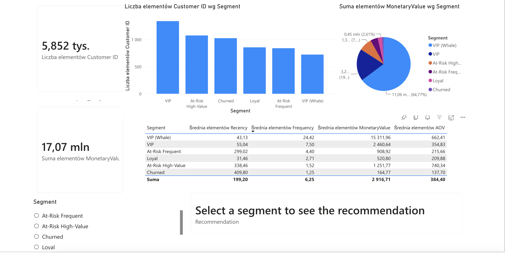

# Data Science project: Customer Segmentation — Online Retail II

RFM-based customer segmentation using KMeans clustering (benchmarked against GMM) on the UCI Online Retail II dataset (2009–2011, ~1M transactions). Segments ~5,850 customers into five actionable groups with tailored marketing recommendations, a potential revenue opportunity (win-back + upsell), and a baseline comparison confirming clustering outperforms simple RFM quintile scoring — dashboard in Power BI.

---

## Project Structure

```
src/            # modular pipeline (cleaning, features, outliers, transform,
                # clustering, business_impact, inference)
tests/          # pytest unit tests for each module
notebooks/      # clustering.ipynb — full EDA, statistical reasoning, and
                # business narrative (the primary artifact)
```

---

## Development

```bash
python3 -m pip install -r requirements.txt
python3 -m pytest tests/ -v
```

---

## Pipeline

```
Raw Excel → Cleaning → Feature Engineering → Outlier Removal
→ Yeo-Johnson Transform → PCA (3 components) → KMeans (k=5)
→ Outlier Re-integration → Visualization and Recommendations
```

---

## Data Cleaning

Raw data contains 1,067,371 transactions across two sheets. Cleaning steps include filtering invoices to standard 6-digit format (removing cancellations prefixed with `C` and accounting adjustments prefixed with `A`), filtering stock codes to valid 5-digit product codes only, removing rows with zero or negative prices and quantities, dropping missing Customer IDs, and removing duplicates. Final cleaned dataset retains 776,577 rows — approximately 73% of the original.

Schema validation via Pandera is enforced both before and after cleaning to guarantee column types and value constraints.

---

## Feature Engineering

Each customer is aggregated into five features:

- **Recency** — days since last purchase relative to the reference date (2011-12-09)
- **Frequency** — count of unique invoices
- **MonetaryValue** — total spend across all orders
- **AOV** — average order value (MonetaryValue / Frequency)
- **Tenure** — days between first and last purchase

Tenure was ultimately dropped before clustering due to extreme multicollinearity with Frequency (r=0.88) and MonetaryValue (r=0.75), poor data distribution even after transformation, and because it is a passive metric that does not reflect current customer intent.

---

## Outlier Handling

Outliers are identified per feature using the IQR method (1.5× fence) on MonetaryValue, Frequency, and AOV. Outlier customers are not discarded — they are excluded from KMeans training to prevent centroid distortion, then assigned to clusters using the trained model and flagged separately. This preserves all customers in the final output while keeping the model robust.

---

## Transformation and Dimensionality Reduction

All features are heavily right-skewed, confirmed by descriptive skew/kurtosis coefficients and Q-Q plots (formal tests skipped — unreliable at n>4000). Yeo-Johnson power transformation is applied to normalize distributions. A secondary robust Z-score check (using median and MAD) confirms that remaining post-transformation outliers are negligible in both count and impact.

PCA reduces the four transformed features to three components explaining ~99.8% of variance, decorrelating the high multicollinearity between MonetaryValue and Frequency (r=0.85) before clustering.

---

## Clustering

KMeans is evaluated for k=2 through k=8 using global silhouette score, Davies-Bouldin index, and per-cluster silhouette distributions visualized as boxplots.

No single metric unanimously agrees on an optimal k, so the final choice integrates statistical evidence with business interpretability.

k=5 is selected. It wins two of three metrics against k=4 (Davies-Bouldin and Silhouette), and k=4 is further ruled out because it merges At-Risk High-Value and At-Risk Frequent into a single segment — two groups that differ critically in AOV (£426 vs £216 on non-outlier training data) and require entirely different marketing strategies. Convergence is confirmed at 14 iterations; max_iter=50 is retained 
as a safety margin.

GMM was tested as an alternative to KMeans on both raw transformed features 
(silhouette 0.28, DB 1.00) and PCA-reduced input (silhouette 0.27, DB 1.01) — 
nearly identical either way, confirming GMM's near-tie with KMeans (silhouette 
0.301, DB 1.057) holds regardless of feature space. KMeans is retained for its 
cleaner hard-label output, better suited to the marketing use case.

---

## Baseline Comparison

A naive R+F+M quintile-sum baseline (5 equal-sized buckets, same K as KMeans) was tested to confirm clustering adds value over simple rule-based scoring. KMeans outperforms it on silhouette (0.301 vs 0.115) and Davies-Bouldin (1.057 vs 2.538), though this partly reflects that KMeans directly optimizes this objective — a standard comparison in RFM-vs-clustering literature, but directionally biased in KMeans' favor.

The stronger case is structural: the baseline's AOV increases only mildly and monotonically across its buckets (£202 → £319), never distinguishing high-AOV/low-frequency customers from low-AOV/high-frequency ones, since summing R+F+M collapses these into the same score. KMeans separates At-Risk High-Value (AOV £740) from At-Risk Frequent (AOV £207) despite similar overall RFM standing — a distinction quintile summing cannot make by construction.

---

## Segments

**VIP** (2,060 customers) — £6,965 avg spend, 13.4 orders, 51 days recency. Accounts for 84.1% of total revenue. 722 of these customers are statistical outliers, likely wholesale or B2B buyers. Loyalty programs, early access, and dedicated account managers for the outlier sub-group.

**Promising** (855 customers) — £521 avg spend, 2.7 orders, 31 days recency. Most recently active segment after VIP. Cross-sell and upsell to migrate toward VIP.

**At-Risk High-Value** (1,074 customers) — £1,252 avg spend, 1.5 orders, 338 days recency, highest AOV at £740. They spend big when they buy but are now disengaged. Personalized win-back campaigns before full churn.

**At-Risk Frequent** (839 customers) — £909 avg spend, 4.4 orders, 299 days recency. Were regular buyers now disengaged. Bundle deals and volume incentives to reactivate purchase habits.

**Churned** (1,024 customers) — £165 avg spend, 1.3 orders, 410 days recency. Lowest value segment. Low-cost automated email only; deprioritize after 2–3 attempts with no response.

---

## Estimated Business Impact

Illustrative win-back revenue potential: customers × industry-benchmark reactivation rate × AOV (value of one recovered order).

| Segment | Customers | AOV | Low | Mid | High |
|---|---|---|---|---|---|
| At-Risk High-Value | 1,074 | £740 | £39.7k | £79.5k | £119.2k |
| At-Risk Frequent | 839 | £207 | £8.7k | £17.4k | £26.1k |
| Churned | 1,024 | £127 | £2.6k | £4.6k | £6.5k |
| **Total (mid-case)** | | | | **~£101k** | |

Assumptions: rates are illustrative industry benchmarks, not fitted to this data.


Illustrative upsell revenue potential: customers migrating from Promising-level spend (£521) to VIP-core-level spend (£2,461) — a different mechanism than win-back, using more conservative migration rates (3–12%) than typical single-purchase upsell benchmarks (10–25%).

| Segment | Customers | Δ Spend | Low | Mid | High |
|---|---|---|---|---|---|
| Promising → VIP | 855 | £1,940 | £49.8k | £116.1k | £199.0k |

*Δ Spend based on VIP core avg spend (£2,461, excluding whale outliers), not the £6,965 blended VIP average shown above.

**Combined estimated impact (mid-case): ~£217k**

---

## Model Validation

Distributional stability is verified by splitting the dataset at December 2010 and applying the already-trained pipeline to each half independently — segment proportions shift by no more than 1.6 percentage points. 
Cluster stability is confirmed via Adjusted Rand Index across four random seeds (ARI ≥ 0.99). 
Bootstrap stability is confirmed across 100 resampled iterations (mean ARI: 0.857 ± 0.082).
Statistical separation between clusters is confirmed by Kruskal-Wallis tests (p ≈ 0 for all four features). An end-to-end inference demo validates that seven synthetic customers with known profiles each land in the correct segment.

---

## Outputs

- `outputs/customer_segments.xlsx` — full clustered customer dataset for the marketing team
- `outputs/cluster_summary.xlsx` — cluster mean statistics
- `artifacts/kmeans_k5.pkl` — trained KMeans model
- `artifacts/power_transformer.pkl` — fitted Yeo-Johnson transformer
- `artifacts/pca.pkl` — fitted PCA (3 components)
- `artifacts/iqr_bounds.pkl` — outlier detection bounds
- `artifacts/reference_date.pkl` — training reference date
- `artifacts/cluster_labels_names.pkl` — cluster index to segment name mapping
- `outputs/cluster_summary_normalized.xlsx` — cluster means normalized to 0–100 scale, for cross-feature comparison on one chart

All artifacts enable end-to-end inference on new customers without retraining.

---

## Power BI Dashboard



Interactive Power BI dashboard presenting the customer segmentation: segment size distribution, revenue share, and key metrics (Recency, Frequency, Monetary, AOV) per segment with recommendations for each segment.

Full version: [dashboard.pdf](dashboard/dashboard.pdf)

---

## Limitations

Silhouette scores are weak (0.28–0.36), which is expected given that customer behavior is inherently continuous and cluster overlap is unavoidable. 

Data covers 2009–2011 and retraining is required for current customer behavior. 
The reference date is fixed to the training data, meaning Recency values will inflate systematically over time in production without updating it.

MonetaryValue = AOV × Frequency is an algebraic identity introducing feature redundancy, partially mitigated by PCA decorrelation but not fully eliminated.

---

## Stack

`pandas` · `numpy` · `scikit-learn` · `seaborn` · `matplotlib` · `scipy` · `pandera` · `joblib` · `pytest`

---

The code includes descriptive markdown cells throughout, and every decision is justified visually, statistically, and from a business perspective.
